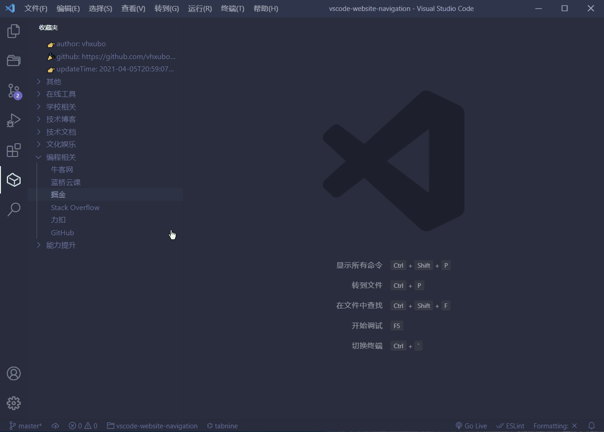
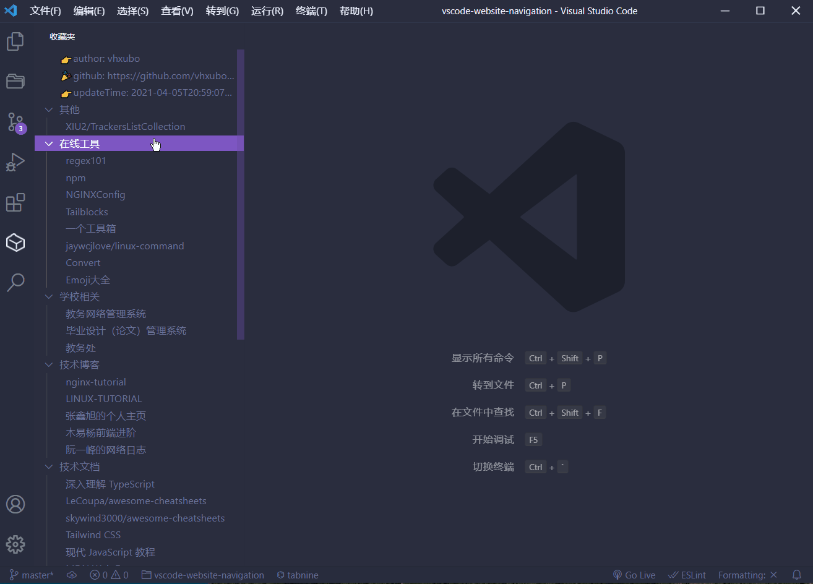

# vscode-website-navigation

在VSCode里面使用[vhxubo/websites](https://github.com/vhxubo/websites)数据接口

## 功能

- 适配[vhxubo/websites](https://github.com/vhxubo/websites)数据接口
- 访问GitHub RAW和jsDelivr中最快的数据接口（避免插件卡顿）
- 支持设置导航仓库地址
- 支持VSCode筛选
- 支持点击打开

PS: 杀毒软件可能会拦截VSCode打开网页，请设置为`一直允许`

## TODO

- 一键展开/收缩
